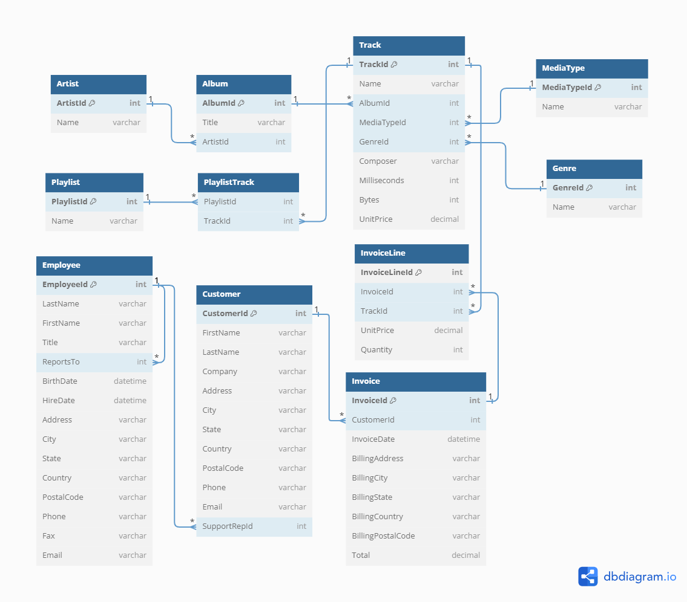

# Music-Store-Analysis

This repository explores a music store dataset using PostgreSQL to uncover valuable insights. Key findings include identifying top-selling artists, customer segmentation based on purchase behavior, and seasonal sales patterns.

## Tools Used

- PostgreSQL

## Data

- The dataset contains information about artists, albums, genres, invoices, customer information and info about employees working at the store.

## Questions

1. Who is the senior most employee based on job title?

2. Which countries have the most Invoices?

3. What are top 3 unique values of total invoice?

4. Which city has the best customers? We would like to throw a promotional Music Festival in the city we made the most money. Write a query that returns one city that has the highest sum of invoice totals. Return both the city name & sum of all invoice totals
5. Who is the best customer? The customer who has spent the most money will be declared the best customer. Write a query that returns the person who has spent the most money

6. Write query to return the email, first name, lASt name, & Genre of all Rock Music listeners. 
Return your list ordered alphabetically by email starting with A

7. Let's invite the artists who have written the most rock music in our datASet. 
Write a query that returns the Artist name and total track count of the top 10 rock bands

8. Return all the track names that have a song length longer than the average song length. 
Return the Name and Milliseconds for each track. 
Order by the song length with the longest songs listed first

9. Find how much amount spent by each customer on best selling artist? 
Write a query to return customer name, artist name and total spent

10. We want to find out the most popular music Genre for each country. 
We determine the most popular genre AS the genre with the highest amount of purchASes. 
Write a query that returns each country along with the top Genre. 
For countries WHERE the maximum number of purchASes is shared return all Genres

11. Write a query that determines the customer that has spent the most on music for each country. Write a query that returns the country along with the top customer and how much they spent. For countries WHERE the top amount spent is shared, provide all customers who spent this amount
